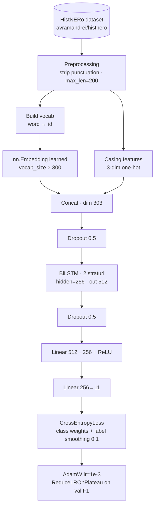

# HistRoNER - Historical Romanian Named Entity Recognition
A benchmark comparing BiLSTM and fine-tuned BERT-based models for Named Entity Recognition on historical Romanian text from the period 1800–1950.

