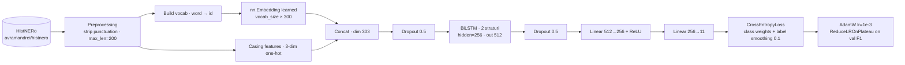

# HistRoNER - Historical Romanian Named Entity Recognition
A benchmark comparing BiLSTM for Named Entity Recognition on historical Romanian text from the period 1800–1950.

============================================================
BENCHMARK RESULTS — BiLSTM-NER (no pretrained embeddings)
============================================================
                precision    recall  f1-score   support

        DATE     0.3881    0.4727    0.4262        55
         LOC     0.5000    0.5727    0.5339       227
         ORG     0.4109    0.4536    0.4312       183
        PERS     0.3476    0.3757    0.3611       173
        PROD     0.2667    0.2727    0.2697        44

   micro avg     0.4152    0.4633    0.4380       682
   macro avg     0.3826    0.4295    0.4044       682
weighted avg     0.4133    0.4633    0.4368       682

micro-avg            P=0.4152  R=0.4633  F1=0.4380
